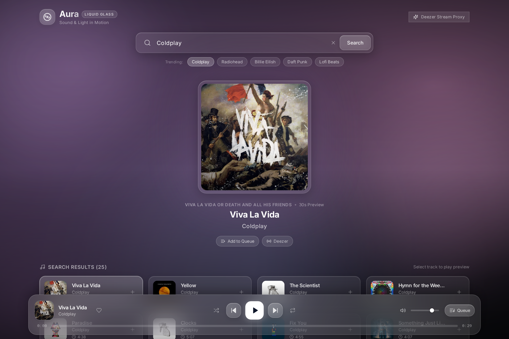
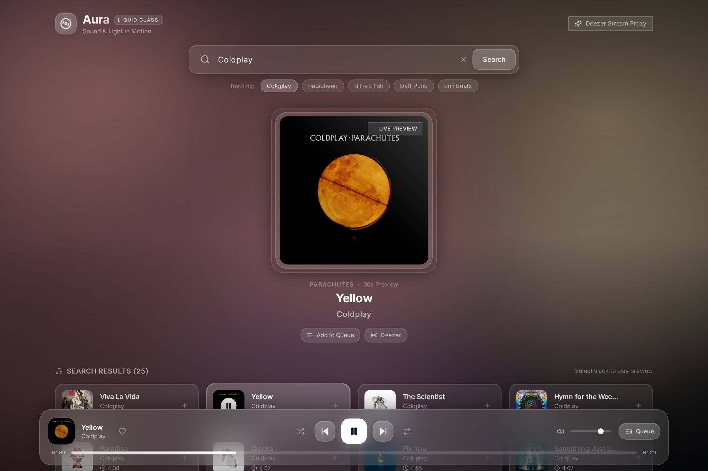

# 💧 Aura — Liquid Glass Music Player

**Aura** is a modern, aesthetic web music player featuring an organic **Liquid Glass** (glassmorphism) design system. Powered by Vite, React, Tailwind CSS, and Framer Motion on the frontend with an Express proxy backend for the Deezer API.

Aura extracts dominant colors from album covers using `fast-average-color`, dynamically blending them into soft pastel mesh gradients accompanied by three slowly moving ambient liquid blobs.

---

## 📸 Preview

### Search & Track Overview (Coldplay - Viva La Vida)


### Real-Time Playback & Dynamic Palette Transition (Coldplay - Yellow)


---

## ✨ Features

- **Liquid Glass Aesthetic**:
  - Deep frosted glass panels (`backdrop-blur-xl`, `bg-white/10`, `border-white/20`, soft specular glow).
  - Ambient liquid mesh background with three floating organic blobs moving slowly.
  - Large centered album art featuring a dynamic radial glow matched to the album's colors.
  - Elegant Inter typography with subtle animations, avoiding harsh cyberpunk or neon grids.

- **Dynamic Color Extraction**:
  - Real-time dominant color sampling from album covers using `fast-average-color`.
  - Intelligently converted into gentle, calming pastel palettes (`primary`, `secondary`, `tertiary`).
  - Seamless CSS color transitions when switching tracks.

- **Deezer API Integration & CORS Proxy**:
  - Express backend proxy running in `/server` querying `https://api.deezer.com/search`.
  - Image proxy endpoint (`/api/proxy-image`) to prevent HTML5 Canvas CORS taint during color sampling.

- **Full Audio Player Controls**:
  - 30-second high-quality preview streaming using HTML5 `<audio>`.
  - Play, Pause, Previous, Next, Shuffle, and Repeat modes.
  - Interactive seek progress bar with real-time timestamps.
  - Smooth volume control slider with instant mute toggle.
  - Slide-over **Queue Drawer** to manage upcoming tracks and playlist flow.

- **Smooth Animations**:
  - Staggered entrance animations for search result glass cards via Framer Motion.
  - Micro-interactions on buttons, album hover zoom, and sound wave indicators.

---

## 🛠️ Tech Stack

| Component | Technology |
| :--- | :--- |
| **Frontend Framework** | [React 18](https://react.dev/) + [Vite](https://vitejs.dev/) |
| **Styling** | [Tailwind CSS](https://tailwindcss.com/) (Glassmorphism & Custom Keyframe Blobs) |
| **Motion & Animation** | [Framer Motion](https://www.framer.com/motion/) |
| **Icons** | [Lucide React](https://lucide.dev/) |
| **Color Analysis** | [fast-average-color](https://github.com/fast-average-color/fast-average-color) |
| **Backend Server** | [Node.js](https://nodejs.org/) + [Express](https://expressjs.com/) + [CORS](https://github.com/expressjs/cors) |
| **Data Source** | [Deezer API](https://developers.deezer.com/api) |

---

## 📁 Project Structure

```
├── public/                 # Static assets
├── server/                 # Express backend proxy
│   ├── index.js            # Express server (Deezer & image proxy)
│   └── package.json        # Backend dependencies
├── src/
│   ├── components/
│   │   ├── Header.jsx             # Brand logo & glass search bar
│   │   ├── LiquidBackground.jsx   # Pastel mesh gradient & 3 liquid blobs
│   │   ├── NowPlayingCenter.jsx   # Big album cover with ambient glow
│   │   ├── PlayerBar.jsx          # Bottom glassmorphism audio player bar
│   │   ├── QueueDrawer.jsx        # Slide-over queue manager
│   │   └── SearchResults.jsx      # Glass cards with stagger animations
│   ├── utils/
│   │   └── colorExtractor.js      # Palette generator using fast-average-color
│   ├── App.jsx                    # Root application component
│   ├── index.css                  # Tailwind styles & glass utility classes
│   └── main.jsx                   # React entry point
├── screenshots/            # Project preview screenshots
├── index.html              # HTML template with Inter font
├── package.json            # Frontend dependencies & scripts
├── tailwind.config.js      # Tailwind configuration & keyframes
└── vite.config.js          # Vite config with backend proxy routing
```

---

## 🚀 Getting Started

### Prerequisites

- [Node.js](https://nodejs.org/) (v18 or higher recommended)
- [npm](https://www.npmjs.com/) or [yarn](https://yarnpkg.com/)

### 1. Clone Repository

```bash
git clone https://github.com/Iky969/Mweb.git
cd Mweb
```

### 2. Install Dependencies

Install root frontend dependencies:
```bash
npm install
```

Install backend proxy dependencies:
```bash
cd server
npm install
cd ..
```

### 3. Run the Application

Start the Express backend (runs on port `3001`):
```bash
# In terminal 1:
cd server
npm start
```

Start the Vite frontend development server (runs on port `5173`):
```bash
# In terminal 2:
npm run dev
```

Open your browser and navigate to:
```
http://localhost:5173
```

---

## 📡 Backend Endpoints

| Method | Endpoint | Description |
| :--- | :--- | :--- |
| `GET` | `/api/search?q=:query` | Proxies search queries to Deezer API (`https://api.deezer.com/search?q=...`) |
| `GET` | `/api/proxy-image?url=:url` | Proxies album cover image with CORS headers for color extraction |
| `GET` | `/api/health` | Health check endpoint |

---

## 📄 License

This project is licensed under the MIT License.
